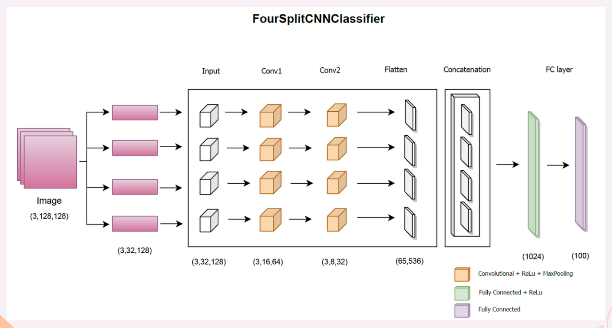

# Senior Project - Gait Recognition Experiment with Web Application

    

## Gait Recognition Models Development

    
    
    

## Application Interface 

    
    

      Home page of the application. User can choose choose to make the classification 
      based on three different models: BigCNN, FourSplitCNN, and TransformerCNN. 
      Then user click the choose files button, which allow user to upload three images f
      rom his or her local machine
    

    
    

      After successfully uploading the images, the website will prompt the user 
      with the message that “Images uploaded successfully!”. Then the user can click the predict button to proceed.
      The three images that user uploaded previously will be displayed on the screen
      This is the prediction result that shows the three similar users to the query user. 
      The result is ranked from the highest probability to the lowest among the top three probabilities.
    

