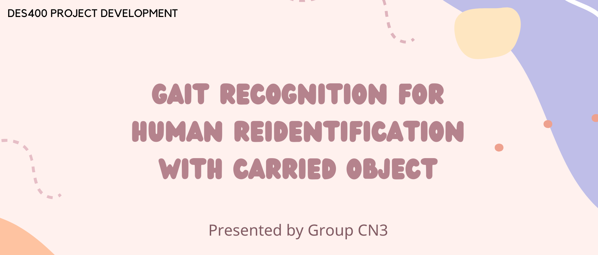
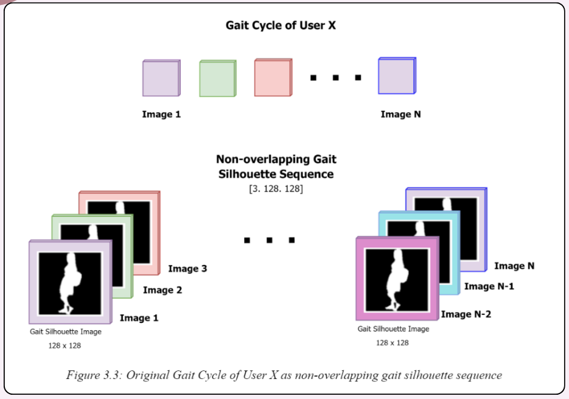
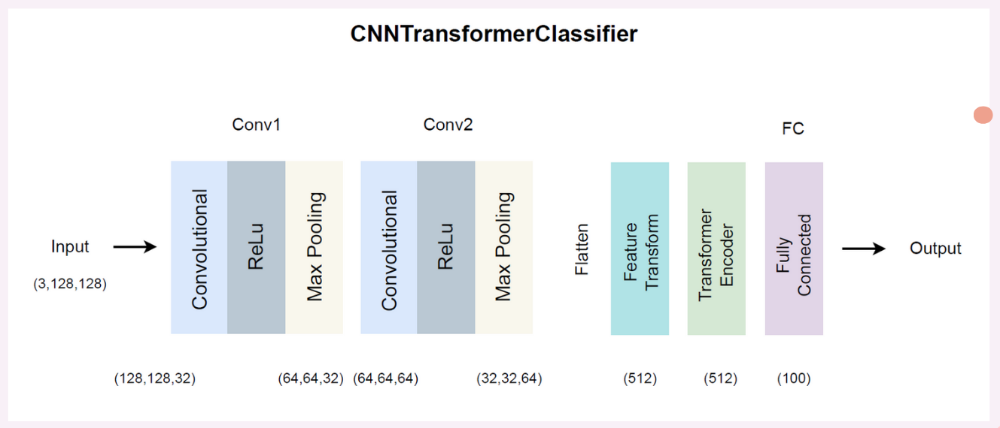

# Senior Project - Gait Recognition Experiment with Web Application

    

---

## Dataset Preparation

    

The GaitSequenceDataset class is our custom PyTorch Dataset class for loading and preprocessing gait silhouette sequence for use in the gait recognition project. It is designed to handle a specific directory structure where silhouette images are organized into subfolders, representing different gait cycles and conditions (with or without carried object). 

Initialization:
the root directory where the preprocessed dataset is located, which varies depending on the developer system
applied specific transformation to the image such as converting them into tensor
the maximum number of users we will consider for the classification training

Loading the Dataset via load_dataset function:
Iterate through the range of specified user ID such as ‘00001’ to ‘00100’ in the case where we set the max_id to 100
For each user, it processes images in the following subfolders 'A1_silhouette', 'A2_silhouette', 'A3_silhouette'. These subfolders correspond to distinct characteristics of the subject
Create non-overlapping sequences of three images and appends the image file paths
Corresponding Ids are converted into integer labels to correspond with the index of the final prediction result. For instance user ID `00001` would be considered user index ‘0’ to align with the 0-index convention. 

Image Loading and Transformation via __getitem__:
Retrieve the sequence of image paths at particular index and load each image
The images are then concatenated along the channel dimension, forming a single tensor. This tensor represents a stack of the three images, which is suitable for input into a neural network that expects multi-channel input. The tensor dimension of a single data point would be [3,128,128] where 3 represents the number of images per sequence and the remaining number represents the dimension of each image.

---

## Gait Recognition Models Development
In this section, three model architecture for gait recognition has been developed. 

### CNNClassifier

    

The CNNClassifier (BigCNN) is a convolutional neural network (CNN) designed for image classification tasks. It takes a sequence of images as input and treats them as a single input with multiple channels. The architecture consists of two convolutional layers (conv1 and conv2) followed by max-pooling layers, which help capture hierarchical features and reduce spatial dimensions. The flattened output is then passed through two fully connected layers (fc1 and fc2) for final classification. The Rectified Linear Unit (ReLU) activation function introduces non-linearity, and max-pooling aids in spatial down-sampling. The model is trained using the Adam optimizer with the cross-entropy loss function. The forward method processes input images through the defined layers, and the training loop involves iteratively updating weights to minimize the classification error. 

### FourSplitCNNClassifier

    

The FourSplitCNNClassifier (FourSplitCNN) is a specialized convolutional neural network designed for image classification, particularly when images are divided into four distinct strips. It operates on an input with three channels, representing the stacking of three grayscale silhouette images. The architecture includes four sets of convolutional layers (conv1_1, conv2_1, ..., conv1_4, conv2_4), each processing a different strip of the input image. These convolutional layers are followed by max-pooling operations to capture important features and reduce spatial dimensions. The output from each strip is then concatenated and flattened before passing through two fully connected layers (fc1 and fc2) for final classification. The Rectified Linear Unit (ReLU) activation function introduces non-linearity, and max-pooling aids in spatial down-sampling. The model is trained using the Adam optimizer with the cross-entropy loss function. Overall the FourSplitCNNClassifier is tailored for scenarios where images are divided into four distinct strips, and it leverages separate convolutional pathways to capture localized features in each strip.

### TransformerCNN

    

The CNNTransformerClassifier (TransformerCNN) is a hybrid neural network that combines convolutional and transformer layers for image classification. It is designed to process sequences of images, treating them as a single input with multiple channels. The architecture begins with convolutional layers (conv1 and conv2) followed by max-pooling operations to extract hierarchical features and reduce spatial dimensions. The flattened output then undergoes a linear transformation (feature_transform) before being reshaped for input to a transformer encoder. The transformer encoder captures long-range dependencies in the sequence of features. The final classification is performed by a fully connected layer (fc) on the output of the transformer encoder. The Rectified Linear Unit (ReLU) activation function introduces non-linearity, and max-pooling aids in spatial down-sampling. The model is trained using the Adam optimizer with the cross-entropy loss function. The CNNTransformerClassifier is suitable for tasks where understanding both local and global dependencies in sequences of images is crucial for accurate classification.

### Prediction Process
The prediction process begins by loading three different models. Input images undergo a common transformation using PyTorch's torchvision.transforms.Compose. The transformed images are then concatenated and converted into a PyTorch tensor. Each model is set to evaluation mode, and the tensor is passed through each model. The model outputs are converted into probabilities using softmax, and the top three probabilities and corresponding class indices are obtained. The user IDs associated with the top three indices are retrieved and returned. It includes functions for visualizing the predictions, with an initial visualization using Matplotlib for the first model and an improved version displaying multiple silhouettes for each user ID. The script is executed with specific image paths, and the results, including top probabilities, class indices, and user IDs, are printed. 

---

## Application Interface 

    
    

      Home page of the application. User can choose choose to make the classification 
      based on three different models: BigCNN, FourSplitCNN, and TransformerCNN. 
      Then user click the choose files button, which allow user to upload three images f
      rom his or her local machine
    

    
    

      After successfully uploading the images, the website will prompt the user 
      with the message that “Images uploaded successfully!”. Then the user can click the predict button to proceed.
      The three images that user uploaded previously will be displayed on the screen
      This is the prediction result that shows the three similar users to the query user. 
      The result is ranked from the highest probability to the lowest among the top three probabilities.
    

